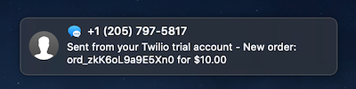
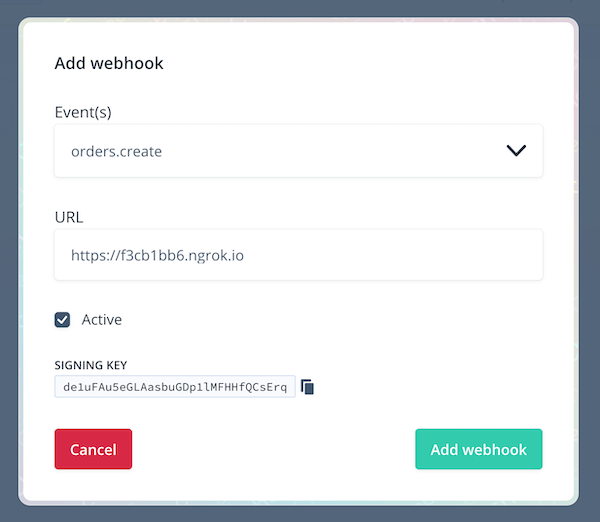
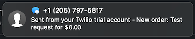

# New order notifications via SMS with Chec and Twilio

This guide is going to give you a bit of an introduction to [webhooks in the Chec Platform](https://commercejs.com/blog/webhooks-for-commerce/), and give a bit of and example of how you could use them to send SMS messages to your phone using [Twilio](https://www.twilio.com/) when new orders are placed in your Chec-powered eCommerce storefront.



Webhooks in the Chec Platform give developers and merchants the ability to automate and streamline their eCommerce actions and processes. The functionality and automation that comes with webhooks is endless. It’s an exciting opportunity to think creatively about your integration and how you can make [Chec and Commerce.js](https://commercejs.com/merchants/) work for you even more.

## Pre-requisites

Here are few things you'll need to run through this guide. We won't go into the specifics of these unless necessary.

* [Node.js](https://nodejs.org) installed and available in your terminal
* [ngrok](http://ngrok.io/) installed and available in your terminal
* A phone, with a number
* A [Chec account](https://dashboard.chec.io), with some products
* A [Twilio account](https://www.twilio.com), with your destination phone number [verified](https://support.twilio.com/hc/en-us/articles/223180048-Adding-a-Verified-Phone-Number-or-Caller-ID-with-Twilio)

## Create your project

Jump into your terminal and create a folder, then initialise your project in it. We'll be using Node.js for this, primarily because it transports easily into serverless functions which work nicely on a [JAM stack](https://jamstack.org/).

```
mkdir chec-order-callback
cd chec-order-callback
yarn init # or npm init
```

Fill our the prompts in the `yarn init` process as you wish, they're optional for us in this case. When you've done that, let's get started by installing the only dependency we need for this project; [the Twilio Node.js SDK](https://www.twilio.com/docs/libraries/node):

```
yarn add twilio
```

Lastly, let's create a simple script to power our server:

```js
// File: index.js
const http = require('http');

const requestListener = (request, response) => {
  const chunks = [];
  request.on('data', chunk => chunks.push(chunk));
  request.on('end', () => {
    console.log('Received request');
    response.writeHead(200);
    response.end();
  });
};

const server = http.createServer(requestListener);
server.listen(8080); // Change this if port 8080 is already in use

console.log('Listening for incoming webhooks...');
```

Once you've saved this file, run `node index.js` in your terminal. You'll then have a server listening for requests.

``` 
# Start server
node index.js
Listening for incoming webhooks...
```

### Start ngrok

Since we're developing this in our local environments, we don't have the web server exposed to the world. We can use [ngrok](https://ngrok.io) to create a public tunnel for us, then use its temporary public address to reference our local web server. Let's set this up in a new terminal window now so it's ready to go:

```
ngrok http 8080
```

You should now some statistics about the connection and your account. The key piece of information we need is the "Forwarding" address, which tells us what the public address for our local server.

```
Forwarding                    https://f3cb1bb6.ngrok.io -> http://localhost:8080 
```

Let's go ahead and test the server connection with cURL:

``` 
curl https://f3cb1bb6.ngrok.io
```

Your server terminal should have now output "Received request".

## Set up your Chec webhook

At this point we can connect Chec to our local server (via ngrok) and get the signing key for the webhook. Head to the [Chec Dashboard](https://dashboard.chec.io) and go to the Setup > Webhooks section. Let's add a new webhook, selecting the `orders.create` event and entering our ngrok URL:



Copy the signing key while you've got the window open, then save the new webhook. If you view the webhook details you can also send a test request, which will also output "Received request" in your server terminal window. You can also get your signing key here.

## Let's build a server

Okay, now let's make our server actually process incoming webhooks from Chec. There are a few things we need to do with the incoming requests before we actually ask Twilio to send us a message:

* Verify the signature of the webhook. The signature is a representation of the webhook payload, signed by Chec using a "signing key" which is unique to your Chec account. Since you and Chec both know the key, both can create the signature for the payload and compare them to ensure the request is authentic.
* Verify the age of the request. This helps to mitigate [replay attacks](https://en.wikipedia.org/wiki/Replay_attack) by ensuring that the webhook was sent within the last five minutes (for example). Anything older will be ignored.
* Extract the data we want from the webhook payload

### Signature validation

The signature is a SHA256 hash of the payload, using your Chec "signing key" as the salt. We got our signing key in the previous step:

```js
const crypto = require('crypto');

const signingKey = 'de1uFAu5eGLAasbuGDp1lMFHHfQCsErq';

// Extract the signature from Chec
const { signature } = data;
delete data.signature;

// Verify the signature by recreating it and comparing them
const expectedSignature = crypto.createHmac('sha256', signingKey)
  .update(JSON.stringify(data))
  .digest('hex');
if (expectedSignature !== signature) {
  console.error('Signature mismatch, skipping.');
}
```

Now that the signature has been verified we can trust that the webhook came from Chec, and use the payload data as we wish.

### Request age validation

Since webhooks are sent from Chec almost in real-time, the payloads should never be older than 5-10 seconds. We will add some leniency to this and say we accept them for 5 minutes. The created timestamp is in the payload:

```js
// Verify the age of the request, to ensure it wasn't more than 5 minutes old
const maxWebhookAgeSeconds = 5 * 60 * 1000; // milliseconds
if (new Date(data.created * 1000) < new Date() - maxWebhookAgeSeconds) {
  console.error('Webhook was sent too long ago, could be fake, ignoring.');
}
```

### Build the message for Twilio

Now the fun part! What do you want your SMS message to say? Let's use something plain like "New order: {ID} for {value}". Note that test requests from Chec have a different payload structure to what a real one would be, so we have some edge case handling for them too:

```js
const orderId = data.payload.id || 'Test request';
const orderValue = data.payload.order ? data.payload.order.total_with_tax.formatted_with_symbol : '$0.00';
const messageBody = `New order: ${orderId} for ${orderValue}`;
```

Last step is to use Twilio to send us the message. You'll need to grab your "Account SID" and "Auth Token" from the [Twilio console](https://www.twilio.com/console), and you'll also need to get a number in Twilio for it to send from (you get one free to try it all out).

```js
const twilio = require('twilio');

const client = new twilio('YOUR-ACCOUNT-SID', 'YOUR-AUTH-TOKEN');
client.messages
  .create({
    body: messageBody,
    to: '+1987654321', // Your phone number, verified in Twilio's console
    from: '+1123456789', // The registered Twilio number to send from console
  })
  .then((message) => console.log(`Sent message: ${message.sid}`))
  .catch((error) => console.error(error));
```

And we're ready to go!
 
## Putting it together

Now that we have all the parts we need, let's plug them together in our server script. We'll need to parse the JSON body of the incoming request in the request listener, and perhaps provide a more useful console message at the end.

Your script should look something like this now:

```js
// File: index.js
const http = require('http');
const crypto = require('crypto');
const twilio = require('twilio');

const signingKey = 'de1uFAu5eGLAasbuGDp1lMFHHfQCsErq';
const client = new twilio('YOUR-ACCOUNT-SID', 'YOUR-AUTH-TOKEN');

const requestListener = (request, response) => {
    const chunks = [];
    request.on('data', chunk => chunks.push(chunk));
    request.on('end', () => {
        const data = JSON.parse(Buffer.concat(chunks));

        // Extract the signature from Chec
        const { signature } = data;
        delete data.signature;

        // Verify the signature by recreating it and comparing them
        const expectedSignature = crypto.createHmac('sha256', signingKey)
            .update(JSON.stringify(data))
            .digest('hex');
        if (expectedSignature !== signature) {
            console.error('Signature mismatch, skipping.');
        }

        // Verify the age of the request, to ensure it wasn't more than 5 minutes old
        const maxWebhookAgeSeconds = 5 * 60 * 1000; // milliseconds
        if (new Date(data.created * 1000) < new Date() - maxWebhookAgeSeconds) {
            console.error('Webhook was sent too long ago, could be fake, ignoring.');
        }

        // Formulate SMS message
        const orderId = data.payload.id || 'Test request';
        const orderValue = data.payload.order ? data.payload.order.total_with_tax.formatted_with_symbol : '$0.00';
        const messageBody = `New order: ${orderId} for ${orderValue}`;

        // Send it!
        client.messages
            .create({
                body: messageBody,
                to: '+1987654321', // Your phone number, verified in Twilio's console
                from: '+1123456789', // The registered Twilio number to send from console
            })
            .then((message) => console.log(`Sent message: ${message.sid}`))
            .catch((error) => console.error(error));

        response.writeHead(200);
        response.end();
        console.log(`${data.response_code} for ${data.event}`);
    });
};

const server = http.createServer(requestListener);
server.listen(8080); // Change this if port 8080 is already in use

console.log('Listening for incoming webhooks...');
```
 
Restart your Node.js server (Ctrl + C then re-run `node index.js`) and we're done. You can fire another test request from the Chec Dashboard's webhook details screen, which should ping your phone:


 
 Go ahead and place a few test orders in your [Chec Spaces store](https://commercejs.com/merchants/) and keep your phone handy.

---

Interested to read more? Webhooks enable you to do a huge range of things. You can connect Chec to thousands of other platforms with [Zapier](http://zapier.com/), [send notifications to your Slack channel](https://dev.to/notrab/get-notified-via-slack-for-new-chec-orders-414m), use serverless functions like this to generate license keys for software and email them out - the sky is the limit.
